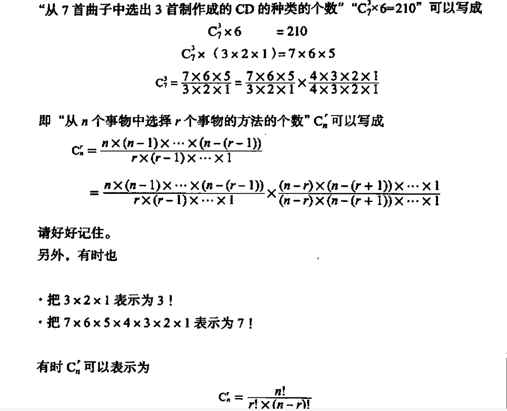
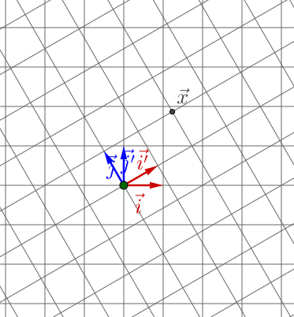
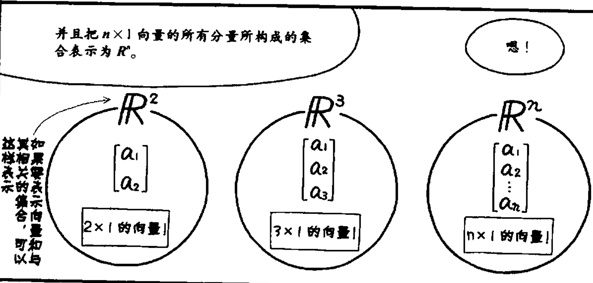
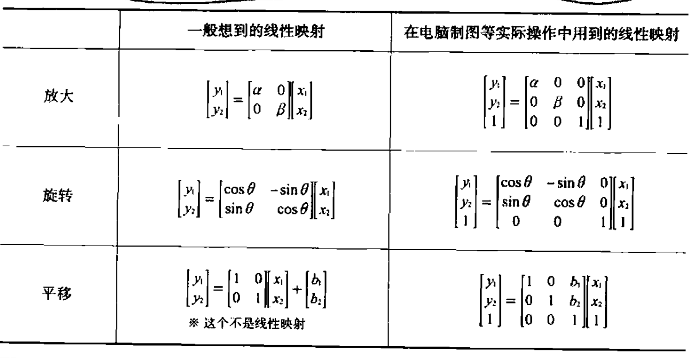
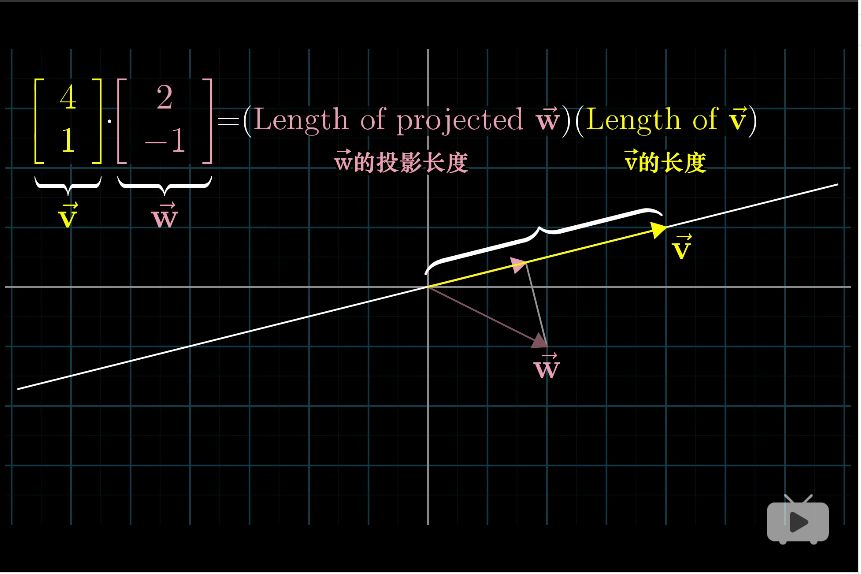

# 线性代数
线性代数就是一门讲m维世界和n维世界联系起来的科学。


## 基础知识
### 数的分类

* 实数
	* 整数
		1. 0
		2. 正整数
		3. 负整数
	* 非整数的有理数
		1. 0.3 这样的的有限小数
		2. 0.3333......这样的循环小数
	* 无理数
		1. 像pi 和2的平方根这样的的无限不循环小数
* 纯虚数


命题：对于因人而异所得出不同判断结果的模糊主张，就不能称之为命题


### 必要和充分条件
如果P成立Q就成立，如果Q成立P就成立，这两个命题都正确的情况。我们就把Q叫做P的充分必要条件，把P叫做Q的充分必要条件。


### 集合
* 当x是集合X的元素时，可以这样表示 x ∈ X 
* 当属于集合X的所有元素都属于集合Y时，可以说集合X是集合Y的子集，可以这样表示 X⊂ Y
* A ⊆ B 表示A是B的子集,即B包含A.但A的元素有可能和B的元素相同,


### 映射
#### 映射
把集合X的元素和集合Y的元素相对应的规则叫做“从集合X到集合Y的映射”。表达方式

```
f:X->Y
```

#### 像
我们把通过映射f与xi对应的集合Y的元素叫xi通过映射f形成的像。一般表示为

```
f(xi)
```

```
f(x)=2x-1
```
这个公式的意思是映射f是集合Y的元素2x-1与集合X的元素x相对应的规则

f(2)的意思是：2通过映射f形成的像是2*2-1

#### 值域和定义域

把由映射f形成的像构成的集合叫做映射f的值域，把集合X叫做映射f的定义域。
值域可以属于集合Y

```
{f(x1),f(x2),f(x3)....,f(xn)}=Y
但一般是
{f(x1),f(x2),f(x3)....,f(xn)}⊂Y

```

### 满射 & 单射 & 满单射
* 当映射f的值域对于集合Y时，就可以说映射f是满射
* 若xi!=xj，则fx！=fy，此时映射就是单射，单射也被称为一对一映射
* 当映射f既是满射也是单射的时候，映射f被称为满单射，又称双射


### 逆映射
当映射f和映射g满足以下两个条件时，就可以说映射g是映射f的逆映射
* g(f(xi))=xi
* f(g(yi))=yi

一般可以这样表示
f-1:X->Y

当映射f对于的逆映射存在 <=> 映射f是满单射

### 线性映射
假设：xi和xj是X的任意两个元素，c为任意实数，f为从X到Y的映射。当映射f满足以下两个条件时，就可以说映射f是从X到Y的线性映射
1. f(xi)+f(xj)=f(xi+xj)
2. cf(xi)=f(cxi)


### 排列组合
* 组合的个数：从n个中选r的个数叫做



* 排列的个数：从n个事物中选r个事物，然后在再将选好的r个事物按照顺序排列的种数


### 矩阵
#### 定义
* 由m行n列数排成的矩阵称为m*n矩阵。
* 矩阵中的数叫元素。
* 行数和列数相等的矩阵称为n阶方阵。
* 方阵对角线上的元素叫对角元素。

用矩阵表示一次方程


#### 矩阵的运算

* 和
* 差
* 倍数:单个数字 * 矩阵
* 积
 
	* [矩阵乘法的本质是什么？](https://www.zhihu.com/question/21351965)
	* 而且左边的矩阵和右边矩阵交换相乘的结果是不一致的
	* 只有当左边矩阵的列数和右边矩阵的行数相等时，两个矩阵才能进行乘法运算

	
	 
	
	向量(x,y)变换之后的结果，将是x乘以变换以后的i帽，加上y乘以变换以后的j帽。这就意味着只要记录下i帽和j帽变换后的位置，就能计算出一个坐标为(x,y)的向量变换后的坐标
	
* n阶方阵的p次幂

#### 特殊矩阵
* 零矩阵：所有元素均为0的矩阵
* 转置矩阵：就是将m*n矩阵的行和列交换后得到的
* 对称矩阵：以对角线为中心线对称的n阶方阵。对称矩阵和他的转置矩阵是完全一样的
* 上三角矩阵：所有对角元素左下角的元素都为0的n阶方阵
* 下三角矩阵：所有对角元素右上方的元素都为0的n阶方阵
* 对角矩阵：对角线以外的元素都是0的n阶方阵。***对角矩阵的乘积就是对角数相乘***
* 单位矩阵：对角线元素都是1，对角线以外的元素都是0的n阶方阵。单位矩阵与任何矩阵相乘对原来的矩阵都没有影响


#### 逆矩阵
与n阶方阵X的积等于单位矩阵的n阶方阵就是X的逆矩阵。

* 并非所有的矩阵都存在逆矩阵，我们把存在逆矩阵的n阶方阵叫做可逆矩阵
* 求逆矩阵的方法有代数余子式和消元法。利用代数余子式计算逆矩阵很麻烦。消元法可以用来计算一次方程。
* 消元法是使得接近为单元矩阵的计算方法。
	
* 二阶方阵的简单计算公式，对于3阶以上的还是用消元发比较好。


#### 行列式
* 如果行列式的值不为0，那么该矩阵的逆矩阵就存在。
* 求解行列式的值的方法因n的值的不同而有所不同

[行列式的本质是什么？](https://www.zhihu.com/question/36966326/answer/70687817) 

***行列式就是线性变换的放大率！***


***2阶方阵的行列值***


***3阶方阵的行列值***


#### 向量
向量是对矩阵的特殊解释。
写成一行的向量称为行向量；写成一列的向量称为列向量


***向量的表示***
1. 假设c为任意实数。点（0，c)可以表示为向量c(0,1) 
2. y轴可以表示为{c(0,1)| c可以是任何实数}
3. 直线x1=3可以表示为集合{3(1,0)+c(0,1)|c是任何实数}
4. x1x2平面可以表示为{c1(0,1)+c2(1,0)| c1 c2为任意实数}，简而言之就是R2


***线性无关&线性相关***

在线性代数里，向量空间的一组元素如果其中没有向量可表示成有限个其他向量的线性组合称为线性无关，反之称为线性相关。例如在三维欧几里得空间R3的三个向量(1, 0, 0)，(0, 1, 0)和(0, 0, 1)线性无关。但(2, 1, 1)，(1, 0, 1)和(3, 1, 2)线性相关，因为第三个是前两个的和。

***基***

线性代数中，基（也称为基底）是描述、刻画向量空间的基本工具。向量空间的基是它的一个特殊的子集，基的元素称为基向量。向量空间中任意一个元素，都可以唯一地表示成基向量的线性组合。如果基中元素个数有限，就称向量空间为有限维向量空间，将元素的个数称作向量空间的维数。

基就是表示R(n)任意元素必须的最少向量构成集合。基的元素线性无关


#### 线性映射
* 线性映射（ linear mapping）是从一个向量空间V到另一个向量空间W的映射且保持加法运算和数量乘法运算，而线性变换（linear transformation）是线性空间V到其自身的线性映射。
* 学习线性映射是为了通过视觉效果更好的理解像的真正意义。
* 特殊的线性映射：放大、旋转、平移



#### 点积
在数学中，数量积（dot product; scalar product，也称为点积）是接受在实数R上的两个向量并返回一个实数值标量的二元运算。它是欧几里得空间的标准内积。[
两个向量a = [a1, a2,…, an]和b = [b1, b2,…, bn]的点积定义为：
a·b=a1b1+a2b2+……+anbn。
使用矩阵乘法并把（纵列）向量当作n×1 矩阵，点积还可以写为：
a·b=a^T*b，这里的a^T指示矩阵a的转置。

